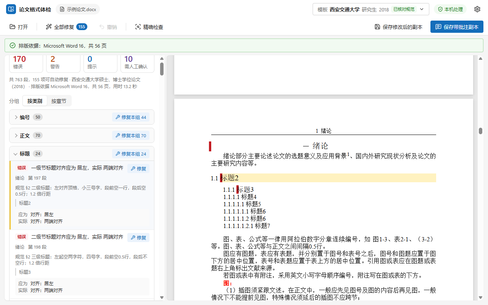

# 论文格式体检 thesisfmt

一个检查学位论文和期刊稿件格式的 Windows 小工具。把 `.docx` 拖进去，它会对照你学校或期刊的格式规范逐条检查，格式问题大多点一下就能改好，改不了的会告诉你在哪一段、应该是什么样。全程离线。



## 为什么写这个

论文写到最后，往往卡在格式上。页眉不对，目录页码对不上，图表没按章编号，参考文献少了悬挂缩进……学校的规范动辄几十页，格式检测一打回来就是几十处，只能翻着规范一处一处核。

这类活大多是机械的。规范写的是「章标题三号黑体居中」，而 Word 文件里每一段用的什么字体、多大字号，程序都读得出来，比对和修改完全可以交给它。

它只在副本上改，你的原文件不会被动。「修复」只改格式，凡是要动文字的地方，都得你逐条看过、点了确认才会写入。它也不联网。不过它替你做的只是交稿前的自查，过不过学校的格式检测，还是学校说了算（见[局限](#局限)）。

## 下载安装

1. 到 [Releases](../../releases/latest) 下载最新版。`.msi` 和 `-setup.exe` 是同一个程序的两种安装包，装哪个都行。
2. 双击安装。安装包没有数字签名，Windows SmartScreen 可能会拦一下，点「更多信息」→「仍要运行」就好。
3. 支持 Windows 10 和 11（x64）。

## 怎么用

### 打开论文

把 `.docx` 拖进窗口，或者点「选择文件」；已经打开过文件时，用工具栏的「打开」。也可以在资源管理器里右键 `.docx`，「打开方式」选它。程序只认 `.docx`，旧的 `.doc` 请先在 Word 里另存为 Word 文档（*.docx）。

### 选规则包

按哪家的规范检查，由顶栏的「模板」决定。第一次打开默认用清华大学硕士（`thu-master`），在搜索框里输入学校名、期刊名或类别（比如「北京」）就能找到你要的那个。换规则包只会重新检查一遍，已经做的修改都还在。更多说明见[模板库](#模板库)。

### 看问题清单

左边是问题清单，可以按类别分组，也可以按章节分组。每条问题标了级别（错误、警告、提示或需人工确认），写明应该是什么、实际是什么，以及出自规范的哪一条。点一条问题，右边的预览会跳到对应段落；在预览里点一段，清单也会定位到这段的问题。

「需人工确认」是程序判断不了的事，比如图是否精选、公式转行是否得当，这些要你自己看。

### 修复格式

能自动修的问题旁边有「修复」按钮，每组有「修复本组」，工具栏上还有「全部修复」。修复只动字体、字号、行距、缩进、页边距这类格式属性，页码格式和三线表的框线也能改，一个字都不会碰。改得不满意就点「撤销」，可以一步步退回去。

为了确保不碰文字，程序在修复前后会把正文和页眉页脚的文字逐字比对一遍，只要有一处不同，这次修复就作废，不生成文件。

### 保存

「保存修改后的副本」会把改好的论文另存一份，默认文件名是 `原名_修复.docx`。想在 Word 里对着问题逐个改，就用「保存带批注副本」，它会把每个问题写成 Word 批注，默认文件名是 `原名_批注.docx`。

两种方式都不会动原文件。有的学校要求提交前删掉全部批注，所以带批注的那份只适合自查，别直接交上去。

### 需要改文字的问题

有些问题光改格式解决不了，必须动文字。比如章序号「第一章」应写成「第1章」，附录编号或关键词分隔符写错了，中文里混进了半角标点、全角字母数字，英文摘要里混进了中文标点。续表题注写得不对，或者标题里还留着模板的说明（像「摘  要（三号黑体，居中）」），也属于这一类。

这类问题旁边的按钮是「改文字…」。点开以后能看到具体改动，删掉的字标红并加删除线，新加的字标绿，空格显示成 ␣。确认没问题再点「确认修改」，不对就点「取消」。每次确认都算单独一步，同样可以撤销。「全部修复」和「修复本组」不会顺手改这些地方。

### 精确检查

有些问题要真正分完页才看得出来，例如表格有没有跨页、续表有没有重复表头、图和图题有没有被拆到两页、参考文献条目有没有跨页。目录页码和实际页码是否一致，章节、摘要和致谢有没有另起一页，摘要和致谢有没有超页，页码起始数字对不对，也都要等分完页才能查。

如果电脑上装了 Microsoft Word 或 WPS 文字，打开文件后程序会自动做一次「精确检查」。它在后台用只读方式打开论文的临时副本，不弹窗口，让 Word 或 WPS 把版排一遍，再按规则包检查分页结果。一份 56 页的模板用 Word 实测要十几秒，其中几秒花在启动 Word 上。

查出的问题里，另起页、跨页表重复表头、图与图题同页、文献条目同页这几类可以直接「修复」，改的只是段落或表格属性。表格跨页了，可以点「拆为续表…」，程序会在跨页的位置把表拆开，插入「续表」题注，并把表头复制到续表第一行。这一步和改文字一样，要你看过说明再确认。

修复或撤销之后，分页可能会变，之前的检查结果也就不作数了，点「重新精确检查」即可。想手动再查一遍，随时可以点工具栏上的「精确检查」。

## 模板库

规则包就是程序检查时依据的规范。点顶栏的「模板」打开模板库，列表分成「我导入的」「高校」「期刊」「其他」四组。

### 内置规则包

程序自带 115 个规则包，其中高校 83 所共 109 个，期刊 6 种各 1 个。同一所学校如果研究生和本科、理工和文科的格式不一样，就分成不同的包，用类别区分。

标「已核对规范」的有 107 个，包里每条规则都对照过该单位的规范原文，或者单位明确指定为规范的官方模板，出处写在规则旁边，检查结果里也看得到。其余 8 个标「未核对规范」，因为只找到了官方模板或样例，没找到说明「以此为准」的文件，规则是按模板的格式和里面的说明文字写的，参考价值要低一些。

### 导入你自己的模板

学校不在列表里，而手头有学校发的 Word 模板，可以点「导入模板…」，选择 `.docx` 或 `.dotx` 文件。程序会从模板的实际格式中提取一个规则包，自动切换过去，并标上「我导入的 · 未核对规范」。

提取的内容有页面设置、页码格式、关键词分隔符和题注编号方式。章标题、正文、摘要等各类段落的字体、字号、加粗、对齐、行距、段前段后和缩进也会提取。页眉、精确检查、三线表、脚注、参考文献这些不提取。每一项都取模板中的多数值，同类段落的格式不统一时，这一项就不写。

需要注意的是，导入只是照搬模板的格式。模板本身不符合规范的地方，导入的包也会跟着错。模板里认不出章标题、正文、摘要这些段落时，导入会失败。

导入的规则包存放在 `%APPDATA%\io.github.thesisfmt\packs\`，文件名形如 `user-<毫秒时间戳>.yaml`。

### 删除

只有导入的规则包可以删除，点列表里那一行的垃圾桶按钮即可，删除后不能恢复。如果删掉的正是当前在用的包，程序会换回默认规则包。内置规则包不能删除。

## 设置

点右上角的齿轮打开设置。改动会立刻保存到 `%APPDATA%\io.github.thesisfmt\settings.json`，每项从什么时候开始起作用，见下表。

| 设置 | 默认 | 说明 |
|---|---|---|
| 工作副本 | 关 | 打开文件时，在原文件所在目录新建 `原名_工作副本.docx`，之后每次修复、撤销都自动写进去，不用手动保存。同名文件已存在时自动编号，不会覆盖。后缀可以改，下次打开文件时生效 |
| 修改后副本的文件名后缀 | `_修复` | 「保存修改后的副本」的默认文件名 |
| 批注副本的文件名后缀 | `_批注` | 「保存带批注副本」的默认文件名 |
| 默认规则包 | 默认（清华大学硕士，没有就用列表第一个） | 启动时选用；还没打开文件时立即切换 |
| 精确检查使用 | 自动（优先 Word） | 电脑上同时装了 Word 和 WPS 时用哪一个 |
| 打开文件后自动精确检查 | 开 | 关掉后，随时可以手动点「精确检查」 |

## 隐私

你的论文不会离开你的电脑。检查和修复都由程序内置的 Rust 代码在本机完成，精确检查调用的也是你自己电脑上的 Word 或 WPS。程序不联网，不做统计，不上传任何东西。

想自己验证，可以断开网络，照常打开一篇论文检查、修复、保存，一切都能正常用。如果愿意看代码：`src-tauri/Cargo.toml` 里没有任何网络库，`src-tauri/tauri.conf.json` 中的内容安全策略（`csp`）也只允许界面连接程序自身。

## 局限

最终以学校为准。不少学校用论无忧这类格式检测系统出具合格证明，结果以学校指定的系统和老师的意见为准。这个程序只是交稿前的预检，帮你先把能改的改掉。

规则包再好，也不会超出规范原文。规范没写清楚的地方，程序不替你猜，要么不查，要么列进「需人工确认」。规范本身有歧义、写成一个区间（比如「段前 30～36 磅」），或者要靠人来判断时，结果还得你自己拿主意。

规范会更新，规则包不一定跟得上。每个包都标了对应的规范版本，如果学校今年发了新规范而包还是旧版，检查结果可能和新要求对不上。遇到这种情况欢迎告诉我，方法见[参与贡献](#参与贡献)。

哪一段是章标题、哪一段是正文、哪一段是图题，是程序根据样式、大纲级别和文字特征推断出来的。拿不准的段落它不会去修，但仍然可能认错。如果某条结果明显离谱，先看看它把那一段认成了什么。

精确检查只在 Word 上实测过。WPS 文字的调用方式是照着 Word 的接口写的，还没在装了 WPS 的电脑上验证。分页以所用程序的排版为准，和打印机或别的软件的分页可能有出入。

## 参与贡献

发现规则查错了、学校规范更新了，或者想给自己学校加一个规则包，都欢迎开 Issue。报告误报时，麻烦附上规则包名称、那条问题里写的「应为」「实际」和「规范」三项，以及学校规范的链接和条款号；能再附一份删掉个人信息的样例就更好了。

提 PR 前，请在本地跑通 `cargo test`、`cargo clippy --all-targets` 和 `npm run build`。另外，请不要提交从学校或期刊下载的模板和规范文件，它们的版权属于发布单位。

## 开发

需要 Node 20+、Rust，以及 [Tauri 2 的系统依赖](https://v2.tauri.app/start/prerequisites/)。

```bash
npm install
npm run tauri dev      # 开发模式运行
npm run tauri build    # 构建安装包
cd src-tauri && cargo test
```

发布交给 `.github/workflows/release.yml`。推送 `v*` 标签后（版本号要和 `src-tauri/tauri.conf.json` 里的 `version` 一致），它会在 Windows 上跑测试，构建 `.msi` 和 `-setup.exe`，然后挂到一个草稿 Release 上。

## 目录结构

- `src/`：React 界面，`App.tsx` 是主窗口，`ReportView.tsx` 是问题清单，`Preview.tsx` 是论文预览，`PackPicker.tsx` 是模板库，`SettingsPage.tsx` 是设置页
- `src-tauri/src/engine/`：Rust 写的检查、批注和修复引擎。`model.rs` 是文档模型，`roles.rs` 识别段落角色，`checks.rs` 是各项检查，`fix.rs` 修复格式，`edit.rs` 处理需确认的文字修改，`layout.rs` 是精确检查，`extract.rs` 从模板提取规则包，`pack.rs` 定义规则包格式
- `src-tauri/src/precise.rs` 和 `src-tauri/src/collect_layout.ps1`：精确检查时调用 Word 或 WPS，收集分页结果
- `src-tauri/packs/`：内置规则包，编译进程序，文件名就是 `meta.id`
- `src-tauri/examples/extract.rs`：编写规则包用的开发工具，有 `draft`、`check`、`test` 三个子命令
- `src-tauri/examples/survey.rs`：在一批模板上统计段落角色识别情况
- `.github/workflows/release.yml`：发布流程

## 许可证

[GPL-3.0](LICENSE)
